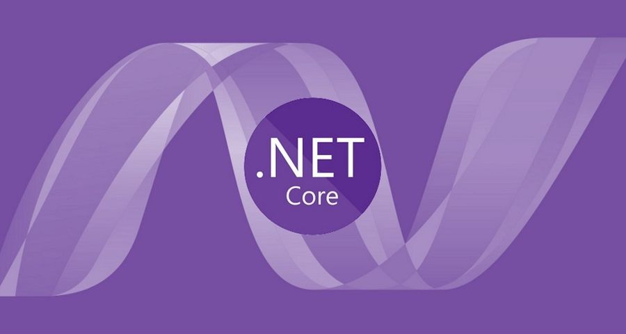

# Sample MVC web application MyMovies

This is a sample application using .Net Core 3 to build a movie database.

We will build an application from scratch, and slowly add layers of advancement until we have a dockerized stack running with SSL encryption and a PostgreSQL databasing hosting our movies.
