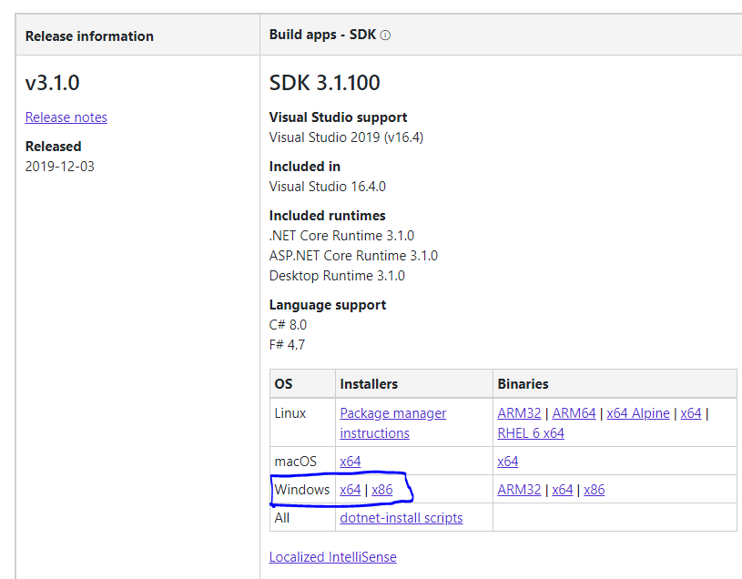

# Introduction #

## Tutorial goal ##

The goal of this tutorial is to:

1. Build a simple .NET Core Web App
1. Make the Web App run on Docker
1. Use Nginx as reverse proxy.
1. Add a PostgreSQL database to the mix.
1. Build a Docker-Compose setup for the stack.

## Tutorial form ##

Templates and scaffolding are great tools to get things started. On the other hand, they also keep developers a bit 'in the dark' about what it takes to build things for themselves.

This tutorial uses a template to create a sample project, this handles a lot of boiler-plate code like setting up stylesheets and javascript and building the startup framework, which all is not the focus of this tutorial. From the initial template, the rest of the tutorial is made by copy-pasting small samples of code, which the user is encouraged to read and understand, if it is not already trivia. Please remember to save files after each paste.

## Prerequisites ##

### PowerShell ###

First of all, this tutorial will make extensive use of PowerShell, so make sure your PowerShell is at least version five.
From a PowerShell console type:

```powershell
Get-Host | Select-Object Version
```

Version should be at least 5.0. If it isn't, follow this [guide](https://docs.microsoft.com/en-us/skypeforbusiness/set-up-your-computer-for-windows-powershell/download-and-install-windows-powershell-5-1) to upgrade.

### Docker Desktop ###

Docker Desktop running with Kubernetes (download [here](https://docs.docker.com/docker-for-windows/install/)).
For this you need to have Hyper-V enabled on your Computer.
When the installer asks if you want to run Linux or Windows containers, be sure to select Linux containers.

> **_NOTE:_** If you are running Windows 10 Home, or for other reasons are unable to enable Hyper-V, Docker Desktop is not an option.
> Alternative possibilities exist, for example [Docker-tools](https://docs.docker.com/toolbox/toolbox_install_windows) and [VirtualBox](https://www.virtualbox.org/wiki/Downloads). In this case your Docker host will be running in a separate IP Address. That is one reason for this tutorial to use the DNS name *dev.mymovies.local* so users with virtual machines only need to substitute 127.0.0.1 with their specific virtual host IP address in the *host* file.

### .NET Core SDK ###

You also need .NET Core SDK 3.1. Verify .NET SDK is installed by opening PowerShell and typing

```powershell
dotnet --info
```

This should provide an output similar to this (possibly a lot of SDK's and runtimes are listed):

```powershell
.NET Core SDK (reflecting any global.json):
 Version:   3.1.100
 Commit:    cd82f021f4

Runtime Environment:
 OS Name:     Windows
 OS Version:  10.0.17763
 OS Platform: Windows
 RID:         win10-x64
 Base Path:   C:\Program Files\dotnet\sdk\3.1.100\

Host (useful for support):
  Version: 3.1.0
  Commit:  65f04fb6db

.NET Core SDKs installed:
  3.1.100 [C:\Program Files\dotnet\sdk]

.NET Core runtimes installed:
  Microsoft.NETCore.App 3.1.0 [C:\Program Files\dotnet\shared\Microsoft.NETCore.App]
  Microsoft.WindowsDesktop.App 3.1.0 [C:\Program Files\dotnet\shared\Microsoft.WindowsDesktop.App]

To install additional .NET Core runtimes or SDKs:
  https://aka.ms/dotnet-download
```

If .NET Core SDK 3.1 is not installed, you can download it [here](https://dotnet.microsoft.com/download/dotnet-core/3.1)

Be sure to pick SDK:



### Editor ###

You also need an editor, [VS Code](https://code.visualstudio.com/download) is a great choice as it has plugins for **git**, **Docker**, **Kubernetes**, **MarkDown** (and almost everything else), and it has excellent **PowerShell** integration.

#### Recommended VS Code plugins: ####

1. [C#](vscode:extension/ms-vscode.csharp)
1. [Docker](vscode:extension/ms-azuretools.vscode-docker)
1. [Kubernetes](vscode:extension/ms-kubernetes-tools.vscode-kubernetes-tools)
1. [YAML](vscode:extension/redhat.vscode-yaml)

### OpenSSL (optional) ###

If you want to play with certificates you will also need **OpenSsl**, there are various sources for downloading. I prefer using [Scoop](https://scoop.sh/) (scoop install openssl)

This tutorial will use the DNS name **dev.mymovies.local**, so you should start an editor running in administrative mode and add this line to C:\Windows\System32\drivers\etc\hosts:

```conf
127.0.0.1 dev.mymovies.local
```

> **_NOTE:_** If you are running docker-tools in a virtual machine, replace 127.0.0.1 with the IP Address of your virtual machine.

### Working directory ###

This tutorial assumes you create a directory in your favourite project directory and open your Powershell (or VS Code embedded PowerShell) inside this directory.

In cases where commands have to be executed in subdirectories, the command(s) will be surrounded by apropriate *pushd* / *popd* directives.

Depending on your situation, you should choose between these two tracks:

Continue to ['Getting started with Docker Desktop'](2_GettingStartedWithDocker.md) or [Getting started with VirtualBox](2_GettingStartedWithVirtualBox.md).
