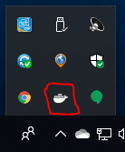
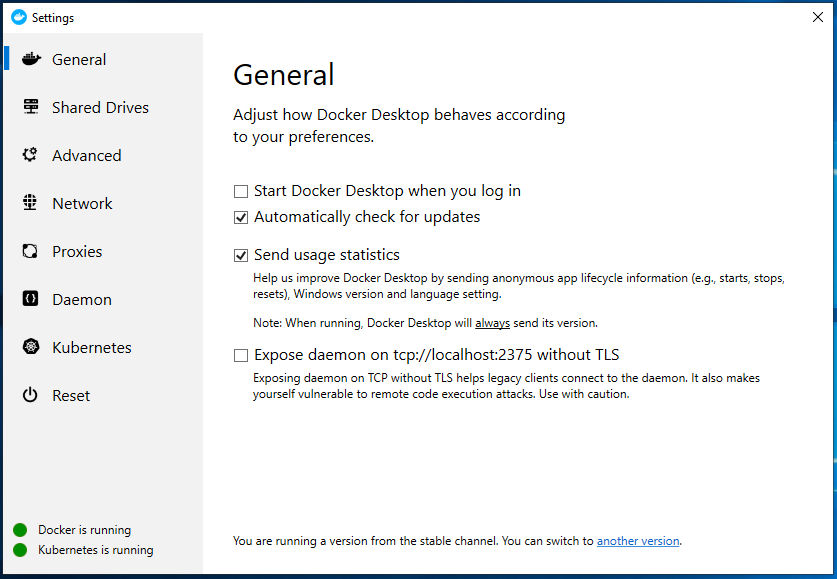
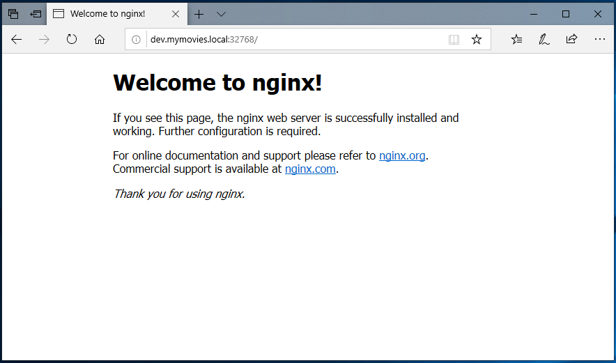

# Getting started with Docker Desktop #

First make sure Docker Desktop is running. From the system tray right-click the whale and choose 'Settings'



From settings window Docker and Kubernetes should both be running.



Lets'try and see that docker works. Open a PowerShell and type the following command:

```powreshell
docker run --name mynginx1 -P -d nginx
```

This produces an output similar to the following:

```powreshell
Unable to find image 'nginx:latest' locally
latest: Pulling from library/nginx
8ec398bc0356: Already exists
465560073b6f: Pull complete
f473f9fd0a8c: Pull complete
Digest: sha256:b2d89d0a210398b4d1120b3e3a7672c16a4ba09c2c4a0395f18b9f7999b768f2
Status: Downloaded newer image for nginx:latest
089a326cfde2b4261645551a00d5ad3b4dfa358d1971a1b6c837ac3470bbef0c
```

Now we can verify that the container is running:

```powershell
docker container ls
```

```powershell
CONTAINER ID        IMAGE               COMMAND                  CREATED             STATUS              PORTS                     NAMES
089a326cfde2        nginx               "nginx -g 'daemon of…"   14 seconds ago      Up 12 seconds       0.0.0.0:32768->80/tcp     mynginx1
```

The PORTS part of the above output is important here. It states that Nginx is running on port 80 as you would expect, but it is mapped to <http://dev.mymovies.local:32768> - you should replace 32769 with your own findings.



Let's stop the Docker container and clean up.

```powershell
docker container stop mynginx1
docker container rm mynginx1
```

Continue building a sample .NET Core Web App ['.NET Core Web App'](3_DotNetCoreWebApp.md)
