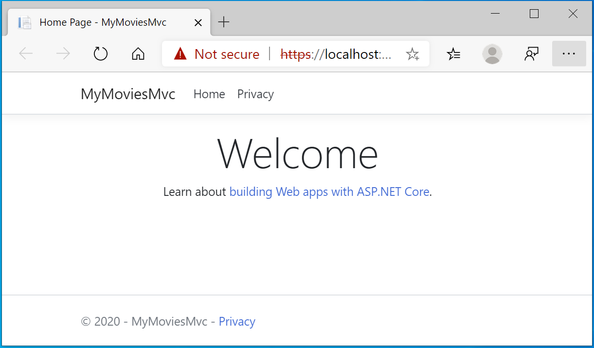

# Build a .NET Core Web App #

For this sample we will build a Web App containing a Movie register.

```powershell
new-item -type directory -path ./src -Force
dotnet new sln -n MyMovies
pushd src
dotnet new mvc -n MyMoviesMvc
popd
dotnet sln add ./src/MyMoviesMvc/MyMoviesMvc.csproj
```

Let's fire up the App and see that it runs:

```powershell
dotnet run --project ./src/MyMoviesMvc/MyMoviesMvc.csproj
```

Point your browser at <https://localhost:5001> and you should see your new app in action:



Press Ctrl-C to end the app.

There is no need to let the Web App handle https forwarding if it is supposed to live inside Docker. We want to have Nginx act as a reverse proxy for our project, so let's go and remove https support from the project.

in *StartUp.cs* we need to add:

```csharp
using Microsoft.AspNetCore.HttpOverrides;
```

... and replace app.UseHttpsRedirection(); with header forwarding:

```csharp
            //Remove this -> app.UseHttpsRedirection();
            app.UseForwardedHeaders(new ForwardedHeadersOptions
            {
                ForwardedHeaders = ForwardedHeaders.XForwardedFor | ForwardedHeaders.XForwardedProto
            });
```

In *Properties/launchsettings.json* remove the "<https://localhost:5001;>" part of MyMoviesMvc.applicationUrl, so it reads:

```json
...
    },
    "MyMoviesMvc": {
      "commandName": "Project",
      "launchBrowser": true,
      "applicationUrl": "http://localhost:5000",
      "environmentVariables": {
        "ASPNETCORE_ENVIRONMENT": "Development"
      }
    }
  }
}
```

## Build and launch Docker container ##

Place a file named *MyMoviesMvc.dockerfile* in the MyMovies folder.

```poweshell
New-Item ./MyMoviesMvc.dockerfile -ItemType File -Value "#Replace this with content from tutorial."
```

```docker
FROM mcr.microsoft.com/dotnet/core/aspnet:3.1-alpine AS base
WORKDIR /app

FROM mcr.microsoft.com/dotnet/core/sdk:3.1-alpine AS build
WORKDIR /src
COPY ["./src/MyMoviesMvc/MyMoviesMvc.csproj", "./"]
RUN dotnet restore "./MyMoviesMvc.csproj"
COPY ./src/MyMoviesMvc .
RUN dotnet build "MyMoviesMvc.csproj" -c Release -o /app/build

FROM build AS publish
RUN dotnet publish "MyMoviesMvc.csproj" -c Release -o /app/publish

FROM base AS final
WORKDIR /app
COPY --from=publish /app/publish .
ENV ASPNETCORE_URLS http://*:5000
ENTRYPOINT ["dotnet", "MyMoviesMvc.dll"]
```

```powershell
docker build -t mymoviesmvc:v1 -f ./MyMoviesMvc.dockerfile .
docker run -d -p 5000:5000 --name mymoviesmvc mymoviesmvc:v1
docker ps
```

Browse to <http://dev.mymovies.local:5000>, nothing much has changed, but we know that our app is now running from a Docker container.

Let's clean up again.

```powershell
docker rm -f mymoviesmvc
docker rmi mymoviesmvc:v1
```

Next we will ['Containerize Nginx'](4_ContainerizeNginx.md)
