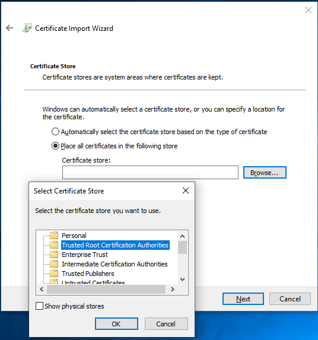
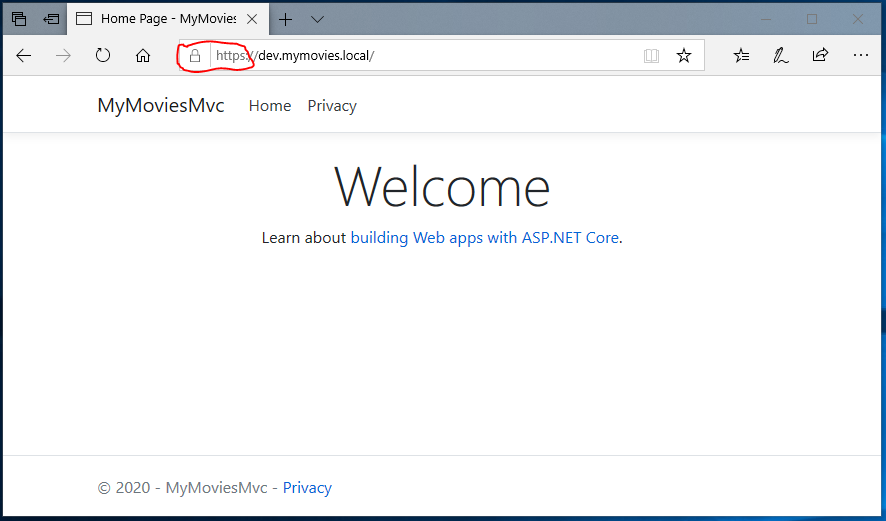
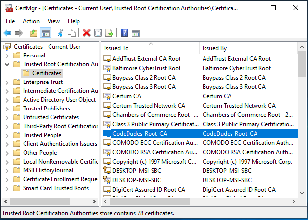

# Containerize Nginx #

We need to run nginx with a custom configuration, so we want to create a customized Nginx Image.

```powershell
New-Item ./Nginx.dockerfile -ItemType File -Value "# Replace this with content from tutorial."
New-Item ./docker-compose.yaml -ItemType File -Value "# Replace this with content from tutorial."
New-Item ./Nginx/nginx.conf -ItemType File -Value "# Replace this with content from tutorial." -force
```

Replace the contents of *Nginx.dockerfile* with this:

```docker
FROM nginx:latest

COPY nginx.conf /etc/nginx/nginx.conf
```

The custom nginx.conf that we need for this project looks like this (replace contents of Nginx/nginx.conf):

```json
worker_processes 1;

events { worker_connections 1024; }

http {

    sendfile on;

    upstream my-moves-mvc {
        server mvc:5000;
    }

    server {
        listen 80;
        server_name $hostname;
        location / {
            proxy_pass         http://my-moves-mvc;
            proxy_redirect     off;
            proxy_http_version 1.1;
            proxy_cache_bypass $http_upgrade;
            proxy_set_header   Upgrade $http_upgrade;
            proxy_set_header   Connection keep-alive;
            proxy_set_header   Host $host;
            proxy_set_header   X-Real-IP $remote_addr;
            proxy_set_header   X-Forwarded-For $proxy_add_x_forwarded_for;
            proxy_set_header   X-Forwarded-Proto $scheme;
            proxy_set_header   X-Forwarded-Host $server_name;
        }
    }
}
```

When the two containers are supposed to communictae between them, it would be possible to configure a common Docker network, but for this sample we prefer to build a docker-compose.yaml:

```yaml
version: "3.7"

services:

  reverseproxy:
    build:
      context: ./Nginx
      dockerfile: ../Nginx.dockerfile
    ports:
      - "80:80"
    restart: always

  mvc:
    depends_on:
      - reverseproxy
    build:
      context: .
      dockerfile: ./MyMoviesMvc.dockerfile
    expose:
      - "5000"
    restart: always
```

This time we build the images with this command:

```powershell
docker-compose build
```

..and start them with:

```powershell
docker-compose up -d
```

You can inspect the running continers with:

```powershell
docker container ps
CONTAINER ID        IMAGE                   COMMAND                  CREATED             STATUS              PORTS                NAMES
3fceaafe01ba        mymovies_mvc            "dotnet MyMoviesMvc.…"   35 seconds ago      Up 33 seconds       5000/tcp             mymovies_mvc_1
2e3721f299e6        mymovies_reverseproxy   "nginx -g 'daemon of…"   36 seconds ago      Up 31 seconds       0.0.0.0:80->80/tcp   mymovies_reverseproxy_1
```

As you can see, mymies_mvc has no ports mapped to dev.mymovies.local and is therefore unreachable from outside of Docker.

Nginx on the other hand exposes port 80 (standard http) and forwards traffic to mymovies_mvc.

Try and point your browser to <http://dev.mymovies.local> (port 80 is implicit).

Again there is not much difference to spot, but we know that this is a quite different setup compared to last time.

Clean up:

```powershell
docker-compose down
```

## Enable SSL Termination ##

One of the benefits of using Nginx as a reverse proxy is that you can configure it to use SSL for secure communication with clients, with requests forwarded to the web app over plain HTTP. To make things work, we wil need a Root certificate and a public / private key pair for *.mymovies.local. You do not have to build these certificates yourself, a sample is provided with this tutorial.

If you would like to generate it yourself, you will needOpenSSL, which can be installed on both macOS and Windows.

For starters, we need a directory for the certificates:

```powershell
new-item -type directory -path ./cert -Force
```

To make the keypair credible to the browsers on our computer, we need to invent a trusted Root Certificate Authorities. This RootCA is used as originator of our keypair. The following commands are all run from the Nginx folder.

The RootCA is built using Openssl:

```powershell
openssl req -x509 -nodes -new -sha256 -days 1024 -newkey rsa:2048 -keyout cert\RootCA.key -out cert\RootCA.crt -subj "/C=DK/CN=CodeDudes-Root-CA"
```

Now that we have defined the RootCA, we can generate the public / private key pair. Start by adding a *domains.ext* file to the Nginx folder:

```conf
authorityKeyIdentifier=keyid,issuer
basicConstraints=CA:FALSE
keyUsage = digitalSignature, nonRepudiation, keyEncipherment, dataEncipherment
subjectAltName = @alt_names
[alt_names]
DNS.1 = *.mymovies.local
```

Then use openssl to Generate MyMovies.key, MyMovies.csr, and MyMovies.crt:

```powershell
openssl req -new -nodes -newkey rsa:2048 -keyout cert\MyMovies.key -out cert\MyMovies.csr -subj "/C=DK/ST=Als/L=Sønderborg/O=MyMovies-Certificates/CN=*.mymovies.local"
openssl x509 -req -sha256 -days 1024 -in cert\MyMovies.csr -CA cert\RootCA.crt -CAkey cert\RootCA.key -CAcreateserial -extfile cert\domains.ext -out cert\MyMovies.crt
```

### Trust the local CA ###

At this point, the site would load with a warning about self-signed certificates. In order to avoid warnings, your new RootCA has to be added to the trusted Root Certificate Authorities.

#### Windows 10: Chrome, IE11 & Edge ####

Windows 10 recognizes .crt files, so you can right-click on RootCA.crt > Install to open the import dialog.

Accept suggestion to install as current user.

For certificate store, opt to place certificate in specific store:



You may need to restart your browser (all instances), before new Root certificate authorities are accepted.

Now that you have created a public / private key pair, you need to update *Nginx.Dockerfile* to copy these files to the container.
Add these two lines to the end of *Nginx.Dockerfile*.

```docker
COPY MyMovies.crt /etc/ssl/certs/MyMovies.crt
COPY MyMovies.key /etc/ssl/private/MyMovies.key
```

...and copy the public / private key pair to the build context of the Nginx container by running these commands from Powershell:

```powershell
COPY cert\MyMovies.crt Nginx\
COPY cert\MyMovies.key Nginx\
```

Next, update *nginx.conf* to load the certificate key pair. Add a server to listen on port 80 and redirect requests to port 443. Modify existing server to listen on port 443 and add ssl_certificate and ssl-certificate_key.

```conf
worker_processes 1;

events { worker_connections 1024; }

http {

    sendfile on;

    # Named endpoint to be used by proxy_pass below.
    upstream my-movies-mvc {
        server mvc:5000;
    }

    # http -> https redirection
    server {
        listen 80;
        server_name dev.mymovies.local;
        location / {
            return 301 https://$host$request_uri;
        }
    }

    # https proxy points https traffic to named endpoint http://my-movies-mvc
    server {
        listen 443 ssl;
        server_name dev.mymovies.local;

        ssl_certificate /etc/ssl/certs/MyMovies.crt;
        ssl_certificate_key /etc/ssl/private/MyMovies.key;
        location / {
            proxy_pass         http://my-movies-mvc;
            proxy_redirect     off;
            proxy_http_version 1.1;
            proxy_cache_bypass $http_upgrade;
            proxy_set_header   Upgrade $http_upgrade;
            proxy_set_header   Connection keep-alive;
            proxy_set_header   Host $host;
            proxy_set_header   X-Real-IP $remote_addr;
            proxy_set_header   X-Forwarded-For $proxy_add_x_forwarded_for;
            proxy_set_header   X-Forwarded-Proto $scheme;
            proxy_set_header   X-Forwarded-Host $server_name;
        }
    }
}
```

Finally, edit the docker-compose.yml file to expose both ports 80 and 443.

```conf
    ports:
      - "80:80"
      - "443:443"
```

Now build and launch the docker images again:

```powershell
docker-compose build
docker-compose up -d
```

This time when you point your browser to <http://dev.mymovies.local> you should be automagically redirected to <https://dev.mymovies.local> indicated by the tiny padlock:



## Clean up Docker-Compose ##

Time to clean up the Docker-Compose containers:

```powershell
docker-compose down
```

## Clean up RootCA certificate ##

If you want to reverse the addition of our phony RootCA, when this tutorial is complete, run **CertMgr.msc** from powershell or Windows Start Menu, navigate to **Certificates** under **Trusted Root Certification Authorities** and delete **CodeDudes-Root-CA**.



Next we will ['Add Movie data'](5_AddMovieData.md)
