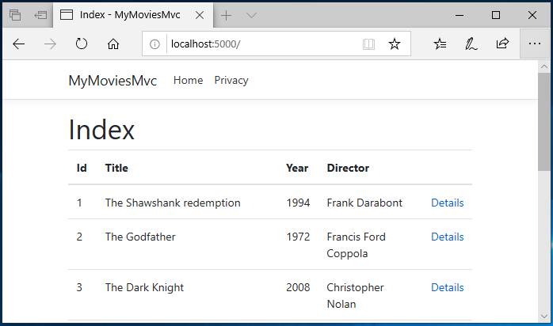

# Add some data to the Movie app #

Our Movie app is a bit dull without movies. Let's go ahead and add some.

For good organzation, we wil add three folders (with files to be edited in this part of the tutorial):

```powershell
new-item -type directory -path ./src/MyMoviesMvc/DataModels -Force
new-item -type directory -path ./src/MyMoviesMvc/Services -Force
new-item -type directory -path ./src/MyMoviesMvc/Views/Movie -Force
New-Item ./src/MyMoviesMvc/DataModels/MovieModel.cs -ItemType File -Value "// Replace this with content from tutorial."
New-Item ./src/MyMoviesMvc/Services/MovieService.cs -ItemType File -Value "// Replace this with content from tutorial."
New-Item ./src/MyMoviesMvc/Views/Movie/Index.cshtml -ItemType File -Value "@*Replace this with content from tutorial.*@"
New-Item ./src/MyMoviesMvc/Views/Movie/Details.cshtml -ItemType File -Value "@*Replace this with content from tutorial.*@"
New-Item ./src/MyMoviesMvc/Controllers/MovieController.cs -ItemType File -Value "// Replace this with content from tutorial."
```

Insert this code in *MovieModel.cs*:

```csharp
namespace MyMoviesMvc.DataModels
{
    public class MovieModel
    {
        public int Id { get; set; }
        public string Title { get; set; }
        public int Year { get; set; }
        public string Director { get; set; }
    }
}
```

Insert this code in *MovieService.cs*:

```csharp
using MyMoviesMvc.DataModels;
using System.Collections.Generic;

namespace MyMoviesMvc.Services
{
    public class MoviesService
    {
        public static List<MovieModel> Movies =>
            new List<MovieModel>
            {
                new MovieModel { Id = 1, Title = "The Shawshank Redemption", Year = 1994, Director = "Frank Darabont" },
                new MovieModel { Id = 2, Title = "The Godfather", Year = 1972, Director = "Francis Ford Coppola" },
                new MovieModel { Id = 3, Title = "The Dark Knight", Year = 2008, Director = "Christopher Nolan" },
                new MovieModel { Id = 4, Title = "The Godfather: Part II", Year = 1974, Director = "Francis Ford Coppola" },
                new MovieModel { Id = 5, Title = "The Lord of the Rings: The Return of the King", Year = 2003, Director = "Peter Jackson" },
                new MovieModel { Id = 6, Title = "Pulp Fiction", Year = 1994, Director = "Quentin Tarantino" },
                new MovieModel { Id = 7, Title = "Schindler's List", Year = 1993, Director = "Steven Spielberg" },
                new MovieModel { Id = 8, Title = "12 Angry Men", Year = 1957, Director = "Sidney Lumet" },
                new MovieModel { Id = 9, Title = "Inception", Year = 2010, Director = "Christopher Nolan" },
                new MovieModel { Id = 10, Title = "Fight Club", Year = 1999, Director = "David Fincher" }
            };
    }
}
```

MovieServices should be available through Dependency Injection. For this to work, we need to modify *startup.cs*.
Add the namesapce to top of file:

```csharp
using MyMoviesMvc.Services;
```

In ConfigureService ad this line:

```csharp
            services.AddScoped<MoviesService>();
```

..while we are editing *startup.cs*, let's modify the default view when starting the app, by replacing *Home* with *Movie* in endpoints.MapControllerRoute:

```csharp
                    pattern: "{controller=Movie}/{action=Index}/{id?}");
```

Insert the following code in *Index.cshtml* (in the Views\Movie folder) to show the list of movies:

```csharp
@model IEnumerable<MyMoviesMvc.DataModels.MovieModel>

@{
    ViewData["Title"] = "Index";
}

<h1>Index</h1>

<table class="table">
    <thead>
        <tr>
            <th>
                @Html.DisplayNameFor(model => model.Title)
            </th>
            <th>
                @Html.DisplayNameFor(model => model.Year)
            </th>
            <th>
                @Html.DisplayNameFor(model => model.Director)
            </th>
            <th></th>
        </tr>
    </thead>
    <tbody>
@foreach (var item in Model) {
        <tr>
            <td>
                @Html.DisplayFor(modelItem => item.Title)
            </td>
            <td>
                @Html.DisplayFor(modelItem => item.Year)
            </td>
            <td>
                @Html.DisplayFor(modelItem => item.Director)
            </td>
            <td>
                @Html.ActionLink("Details", "Details", new { id=item.Id })
            </td>
        </tr>
}
    </tbody>
</table>
```

...and a *Details.cshtml* to view one movie:

```csharp
@model MyMoviesMvc.DataModels.MovieModel

@{
    ViewData["Title"] = "Details";
}

<h1>Detail</h1>

<div>
    <h4>MovieModel</h4>
    <hr />
    <dl class="row">
        <dt class = "col-sm-2">
            @Html.DisplayNameFor(model => model.Title)
        </dt>
        <dd class = "col-sm-10">
            @Html.DisplayFor(model => model.Title)
        </dd>
        <dt class = "col-sm-2">
            @Html.DisplayNameFor(model => model.Year)
        </dt>
        <dd class = "col-sm-10">
            @Html.DisplayFor(model => model.Year)
        </dd>
        <dt class = "col-sm-2">
            @Html.DisplayNameFor(model => model.Director)
        </dt>
        <dd class = "col-sm-10">
            @Html.DisplayFor(model => model.Director)
        </dd>
    </dl>
</div>
<div>
    <a asp-action="Index">Back to List</a>
</div>
```

Finally, we will add a controller to tie everything together. In the Controllers folder, put the following code in *MovieController.cs*:

```csharp
using System.Linq;
using Microsoft.AspNetCore.Mvc;
using MyMoviesMvc.Services;

namespace MyMoviesMvc.Controllers
{
    public class MovieController : Controller
    {
        public MoviesService MoviesService { get; }

        public MovieController(MoviesService moviesService)
        {
            MoviesService = moviesService;
        }

        // GET: Movie
        public ActionResult Index()
        {
            return View(MoviesService.Movies);
        }

        // GET: Movie/Details/5
        public ActionResult Details(int id)
        {
            return View(MoviesService.Movies.FirstOrDefault(m => m.Id == id));
        }

    }
}
```

Let's try and run the app again:

```powershell
dotnet run --project .\src\MyMoviesMvc\MyMoviesMvc.csproj
```

That is a little more interesting:



Terminate the app with Ctrl-C.

Next we will ['Add Entity Framework'](6_AddEntityFramework.md)
