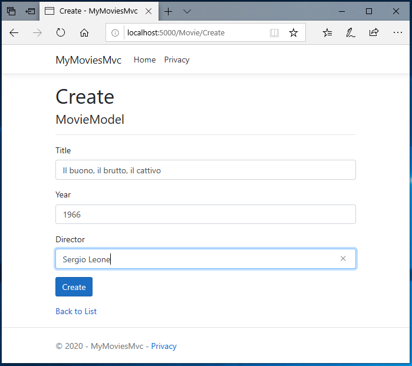

# Adding Entity Framework to the project #

The “hardcoded” data we’ve been using so far has served us well and enabled us to scaffold a simple data application.

But fixed data like this only gets us so far.

Now’s as good a time as any to change direction slightly and see how to get a database into our app so we
can start using real data.

We will install the packages needed for Entity Framework and PostgreSQL. We also install the dotnet tool to handle database migrations.

```powershell
pushd ./src/MyMoviesMvc/
dotnet add package Microsoft.EntityFrameworkCore
dotnet add package Microsoft.EntityFrameworkCore.Tools
dotnet add package Npgsql.EntityFrameworkCore.PostgreSQL
dotnet tool install --global dotnet-ef --version 3.1.0
New-Item ./Context/MovieContext.cs -ItemType File -Value "// Replace this with content from tutorial." -Force
popd
```

Now that we have 'manually' entered information about ten movies iin our hard-coded datafaoundation, let's go and reuse the hard work as 'seed data' to our database.
Seed data is data that the database is seeded with at creation, so we don't have to start with a blank database.

Insert this code in *MovieContexts.cs*:

```csharp
using Microsoft.EntityFrameworkCore;
using MyMoviesMvc.DataModels;

namespace MyMoviesMvc.Context
{

    public class MovieContext : DbContext
    {
        public MovieContext(DbContextOptions<MovieContext> options)
            : base(options)
        { }

        //entities
        public DbSet<MovieModel> Movies { get; set; }

        protected override void OnModelCreating(ModelBuilder modelBuilder)
        {
            modelBuilder.Entity<MovieModel>().HasData(
                new MovieModel { Id = -10, Title = "The Shawshank redemption", Year = 1994, Director = "Frank Darabont" },
                new MovieModel { Id = -9, Title = "The Godfather", Year = 1972, Director = "Francis Ford Coppola" },
                new MovieModel { Id = -8, Title = "The Dark Knight", Year = 2008, Director = "Christopher Nolan" },
                new MovieModel { Id = -7, Title = "The Godfather: Part II", Year = 1974, Director = "Francis Ford Coppola" },
                new MovieModel { Id = -6, Title = "The Lord of the Rings: The Return of the King", Year = 2003, Director = "Peter Jackson" },
                new MovieModel { Id = -5, Title = "Pulp Fiction", Year = 1994, Director = "Quentin Tarantino" },
                new MovieModel { Id = -4, Title = "Schindler's List", Year = 1993, Director = "Steven Spielberg" },
                new MovieModel { Id = -3, Title = "12 Angry Men", Year = 1957, Director = "Sidney Lumet" },
                new MovieModel { Id = -2, Title = "Inception", Year = 2010, Director = "Christopher Nolan" },
                new MovieModel { Id = -1, Title = "Fight Club", Year = 1999, Director = "David Fincher" }
            );
        }
    }
}
```

In *Startup.cs* modify ConfigureServices:

```csharp
        public void ConfigureServices(IServiceCollection services)
        {
            services.AddControllersWithViews();
            services.AddDbContext<MovieContext>(options =>
                options.UseNpgsql(Configuration.GetValue<string>("MyMoviesConnStr")));
            services.AddScoped<MoviesService>();
        }
```

and add these namespace references in the top:

```csharp
using MyMoviesMvc.Context;
using Microsoft.EntityFrameworkCore;
```

also add this method:

```csharp
        private static void UpdateDatabase(IApplicationBuilder app)
        {
            using (var serviceScope = app.ApplicationServices
                .GetRequiredService<IServiceScopeFactory>()
                .CreateScope())
            {
                using (var context = serviceScope.ServiceProvider.GetService<MovieContext>())
                {
                    context.Database.Migrate();
                }
            }
        }
```

..and call it as the first in Configure:

```csharp
        public void Configure(IApplicationBuilder app, IWebHostEnvironment env)
        {
            // add this..
            UpdateDatabase(app);
            // shortened for readability
```

Modify AppSettings.Development.json:

```json
{
  "Logging": {
    "LogLevel": {
      "Default": "Information",
      "Microsoft": "Warning",
      "Microsoft.Hosting.Lifetime": "Information"
    }
  },
  "MyMoviesConnStr": "Host=dev.mymovies.local;Port=54320;Database=MyMoviesDb;Username=postgres;Password=moviedbsecretpassword"
}
```

Make sure the project still builds:

```powershell
dotnet build ./src/MyMoviesMvc/MyMoviesMvc.csproj
```

We will also make the application able to generate and modify it's own database scheme.

```powershell
pushd ./src/MyMoviesMvc
# Create initial migration
dotnet ef migrations add Initial
popd
```

Migrations should now be added to the project.

For development we need a database running 'at our local development PC', but the easiest way to make that happen is a Docker container.
This instance is mapped to dev.mymovies.local on port 54320 to not conflict with any 'real' PostgreSQL installations.

```powershell
docker run --name movie-postgres -e POSTGRES_PASSWORD=moviedbsecretpassword -p 54320:5432 -d postgres:12.1-alpine
```

> **_NOTE:_**  Don't use this approach for production.
>
> This database stores data inside the container, which means data is lost when the container is stopped.

We will rewrite our MovieService.cs to use the MovieContext instead of static data:

```csharp
using MyMoviesMvc.Context;
using MyMoviesMvc.DataModels;
using System.Collections.Generic;

namespace MyMoviesMvc.Services
{
    public class MoviesService
    {
        public MovieContext MovieContext { get; }

        public MoviesService(MovieContext movieContext)
        {
            MovieContext = movieContext;
        }

        public IEnumerable<MovieModel> Movies =>
            MovieContext.Movies;
    }
}

```

Let's try and run the app again:

```powershell
dotnet run --project .\src\MyMoviesMvc\MyMoviesMvc.csproj
```

It should look almost like before, but this time data is fetched from the PostgreSQL database.

Press Ctrl-C to stop the application and let's add code to enable all CRUD (Create Retrieve Update Delete) operations, so we can add our own content.

```powershell
New-Item ./src/MyMoviesMvc/Views/Movie/Create.cshtml -ItemType File -Value "@*Replace this with content from tutorial.*@"
New-Item ./src/MyMoviesMvc/Views/Movie/Edit.cshtml -ItemType File -Value "@*Replace this with content from tutorial.*@"
New-Item ./src/MyMoviesMvc/Views/Movie/Delete.cshtml -ItemType File -Value "@*Replace this with content from tutorial.*@"
```

Replace the contents of *Create.cshtml* with the following code:

```csharp
@model MyMoviesMvc.DataModels.MovieModel

@{
    ViewData["Title"] = "Create";
}

<h1>Create</h1>

<h4>MovieModel</h4>
<hr />
<div class="row">
    <div class="col-md-4">
        <form asp-action="Create">
            <div asp-validation-summary="ModelOnly" class="text-danger"></div>
            <div class="form-group">
                <label asp-for="Title" class="control-label"></label>
                <input asp-for="Title" class="form-control" />
                <span asp-validation-for="Title" class="text-danger"></span>
            </div>
            <div class="form-group">
                <label asp-for="Year" class="control-label"></label>
                <input asp-for="Year" class="form-control" />
                <span asp-validation-for="Year" class="text-danger"></span>
            </div>
            <div class="form-group">
                <label asp-for="Director" class="control-label"></label>
                <input asp-for="Director" class="form-control" />
                <span asp-validation-for="Director" class="text-danger"></span>
            </div>
            <div class="form-group">
                <input type="submit" value="Create" class="btn btn-primary" />
            </div>
        </form>
    </div>
</div>

<div>
    <a asp-action="Index">Back to List</a>
</div>

@section Scripts {
    @{await Html.RenderPartialAsync("_ValidationScriptsPartial");}
}
```

Replace the contents of *Edit.cshtml* with the following code:

```csharp
@model MyMoviesMvc.DataModels.MovieModel

@{
    ViewData["Title"] = "Edit";
}

<h1>Edit</h1>

<h4>MovieModel</h4>
<hr />
<div class="row">
    <div class="col-md-4">
        <form asp-action="Edit">
            <div asp-validation-summary="ModelOnly" class="text-danger"></div>
            <input type="hidden" asp-for="Id" />
            <div class="form-group">
                <label asp-for="Title" class="control-label"></label>
                <input asp-for="Title" class="form-control" />
                <span asp-validation-for="Title" class="text-danger"></span>
            </div>
            <div class="form-group">
                <label asp-for="Year" class="control-label"></label>
                <input asp-for="Year" class="form-control" />
                <span asp-validation-for="Year" class="text-danger"></span>
            </div>
            <div class="form-group">
                <label asp-for="Director" class="control-label"></label>
                <input asp-for="Director" class="form-control" />
                <span asp-validation-for="Director" class="text-danger"></span>
            </div>
            <div class="form-group">
                <input type="submit" value="Save" class="btn btn-primary" />
            </div>
        </form>
    </div>
</div>

<div>
    <a asp-action="Index">Back to List</a>
</div>

@section Scripts {
    @{await Html.RenderPartialAsync("_ValidationScriptsPartial");}
}
```

Replace the contents of *Delete.cshtml* with the following code:

```csharp
@model MyMoviesMvc.DataModels.MovieModel

@{
    ViewData["Title"] = "Delete";
}

<h1>Delete</h1>

<h3>Are you sure you want to delete this?</h3>
<div>
    <h4>MovieModel</h4>
    <hr />
    <dl class="row">
        <dt class = "col-sm-2">
            @Html.DisplayNameFor(model => model.Title)
        </dt>
        <dd class = "col-sm-10">
            @Html.DisplayFor(model => model.Title)
        </dd>
        <dt class = "col-sm-2">
            @Html.DisplayNameFor(model => model.Year)
        </dt>
        <dd class = "col-sm-10">
            @Html.DisplayFor(model => model.Year)
        </dd>
        <dt class = "col-sm-2">
            @Html.DisplayNameFor(model => model.Director)
        </dt>
        <dd class = "col-sm-10">
            @Html.DisplayFor(model => model.Director)
        </dd>
    </dl>

    <form asp-action="Delete">
        <input type="hidden" asp-for="Id" />
        <input type="submit" value="Delete" class="btn btn-danger" /> |
        <a asp-action="Index">Back to List</a>
    </form>
</div>
```

In *Index.cshtml* add this below the header:

```csharp
<p>
    <a asp-action="Create">Create New</a>
</p>
```

...and at the end, add these lines below the details hyperlink tag:

```csharp
                | <a asp-action="Edit" asp-route-id="@item.Id">Edit</a>
                | <a asp-action="Delete" asp-route-id="@item.Id">Delete</a>
```

In *Details.cshtml* add an Edit hyperlink tag before the 'Back to List' tag:

```csharp
    <a asp-action="Edit" asp-route-id="@Model.Id">Edit</a> |
```

The Controller also needs to be updated to implement Update, Edit and Delete operations.

> **_NOTE_** At this point we no longer use the service to provide data. It is a matter of preference if you want the extend the service with CRUD operations and keep using it as middleware between context and controllers, but for simplicity, we use the context directly from the controller.

```csharp
using System.Linq;
using System.Threading.Tasks;
using Microsoft.AspNetCore.Mvc;
using Microsoft.EntityFrameworkCore;
using MyMoviesMvc.Context;
using MyMoviesMvc.DataModels;

namespace MyMoviesMvc.Controllers
{
    public class MovieController : Controller
    {
        private readonly MovieContext _context;

        public MovieController(MovieContext context)
        {
            _context = context;
        }

        // GET: Movie
        public async Task<IActionResult> Index()
        {
            return View(await _context.Movies.ToListAsync());
        }

        // GET: Movie/Details/5
        public async Task<IActionResult> Details(int? id)
        {
            var movieModel = await _context.Movies.FirstOrDefaultAsync(m => m.Id == id);
            if (movieModel == null)
                return NotFound();
            return View(movieModel);
        }

        // GET: Movie/Create
        public IActionResult Create()
        {
            return View();
        }

        // POST: Movie/Create
        // To protect from overposting attacks, please enable the specific properties you want to bind to, for
        // more details see http://go.microsoft.com/fwlink/?LinkId=317598.
        [HttpPost]
        [ValidateAntiForgeryToken]
        public async Task<IActionResult> Create([Bind("Id,Title,Year,Director")] MovieModel movieModel)
        {
            if (ModelState.IsValid)
            {
                _context.Add(movieModel);
                await _context.SaveChangesAsync();
                return RedirectToAction(nameof(Index));
            }
            return View(movieModel);
        }

        // GET: Movie/Edit/5
        public async Task<IActionResult> Edit(int? id)
        {
            var movieModel = await _context.Movies.FindAsync(id);
            if (movieModel == null)
                return NotFound();
            return View(movieModel);
        }

        // POST: Movie/Edit/5
        // To protect from overposting attacks, please enable the specific properties you want to bind to, for
        // more details see http://go.microsoft.com/fwlink/?LinkId=317598.
        [HttpPost]
        [ValidateAntiForgeryToken]
        public async Task<IActionResult> Edit(int id, [Bind("Id,Title,Year,Director")] MovieModel movieModel)
        {
            if (id != movieModel.Id)
                return NotFound();

            if (ModelState.IsValid)
            {
                try
                {
                    _context.Update(movieModel);
                    await _context.SaveChangesAsync();
                }
                catch (DbUpdateConcurrencyException)
                {
                    if (!MovieModelExists(movieModel.Id))
                    {
                        return NotFound();
                    }
                    else
                    {
                        throw;
                    }
                }
                return RedirectToAction(nameof(Index));
            }
            return View(movieModel);
        }

        // GET: Movie/Delete/5
        public async Task<IActionResult> Delete(int? id)
        {
            var movieModel = await _context.Movies.FirstOrDefaultAsync(m => m.Id == id);
            if (movieModel == null)
                return NotFound();
            return View(movieModel);
        }

        // POST: Movie/Delete/5
        [HttpPost, ActionName("Delete")]
        [ValidateAntiForgeryToken]
        public async Task<IActionResult> DeleteConfirmed(int id)
        {
            var movieModel = await _context.Movies.FindAsync(id);
            _context.Movies.Remove(movieModel);
            await _context.SaveChangesAsync();
            return RedirectToAction(nameof(Index));
        }

        private bool MovieModelExists(int id)
        {
            return _context.Movies.Any(e => e.Id == id);
        }
    }
}
```

Now with all CRUD operations in place, let's try and run the app again:

```powershell
dotnet run --project .\src\MyMoviesMvc\MyMoviesMvc.csproj
```

Click the *Create* link and input your own movie:



When retuning to the list of movies, your new movie should be in the list.

Try stopping the application (Ctrl-C) and starting it again. Is you newly created movie still in the list?

> **_NOTE:_**  It is still the case that stopping the PostgreSQL Container will loose data.

Although the PostgreSQL database is running in a container, it has port 5432 exposed to the host, which is not the optimal.

Let's stop the postgresql container:

```powershell
docker rm -f movie-postgres
```

A much better approach is to include the database in the stack so the application has access, but it is inaccesible from outside.

Next we will ['Include the database in Compose'](7_ComposeDatabase.md)
